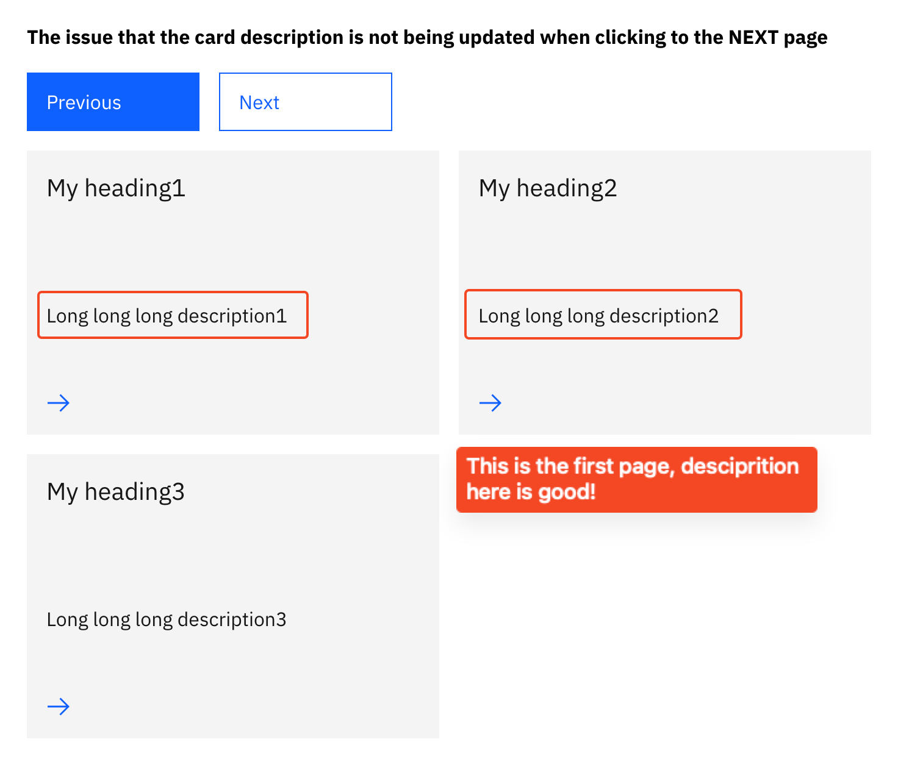
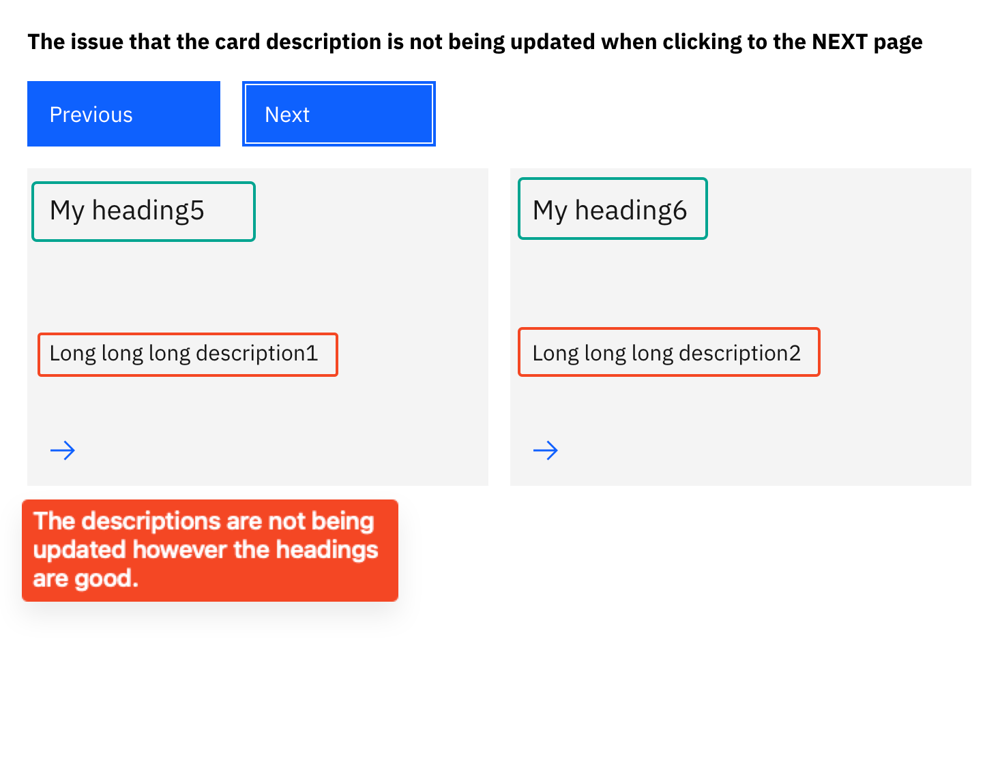

## Description
This repository shows a bug that [Carbon group cards](https://www.ibm.com/standards/carbon/v1/web-components/?path=/docs/components-card-group--default) are not being updated when data source changes.

## Get started

```
# Install the dependencies
npm install

# Start up the website
npm start
```

## Reproduce

Page 1 looks good, 3 items are rendered.



Page 2 is not right, the descriptions (in the middle of the cards) are not being updated. The expected values are: `Long long long description4` and `Long long long description5`.
